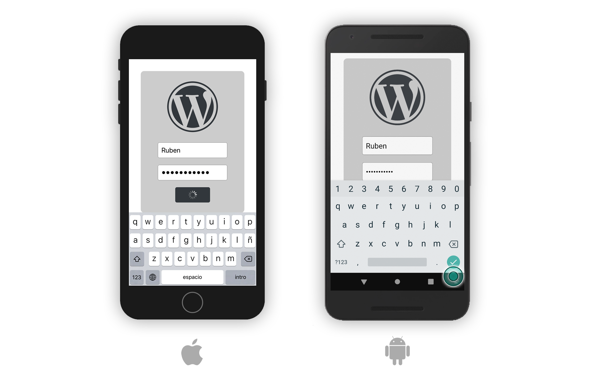

## React Native + Wordpress Rest API

A simple and reusable React Native (@expo) project that connects with a Wordpress Rest API and authenticates using JWT protocol. The folder structure is based on some research about good practices mixed with personal preferences.

## JWT Authentication

I built a simple login form that asks the api for a JWT token and then save it in the device local storage.



## Getting Started
Just follow the typical installing & starting commands.
```
npm install
npm start
```

### Prerequisites

You need a remote online installation of Wordpress with an enabled Rest API.

### Installing
